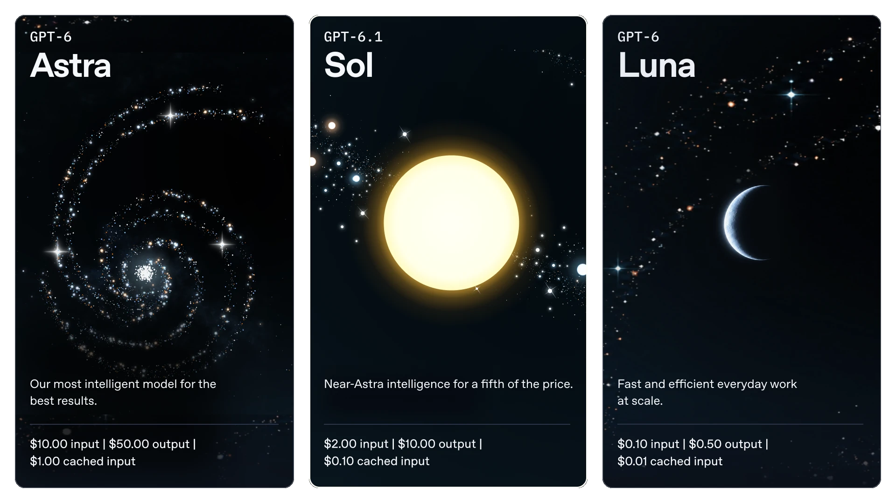
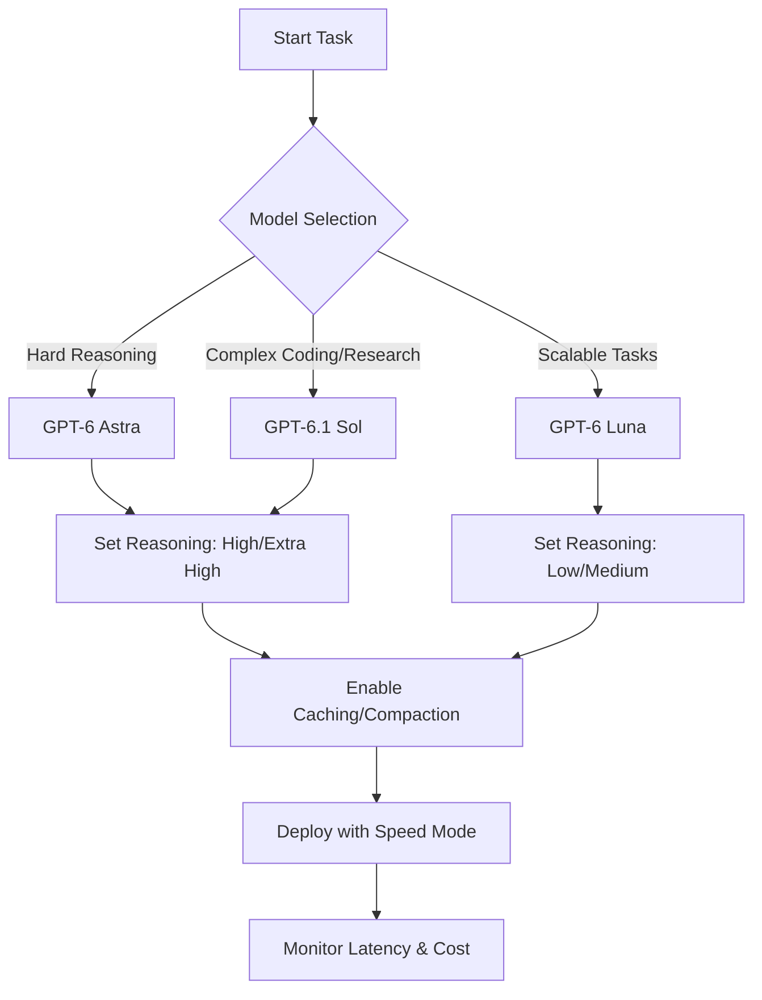
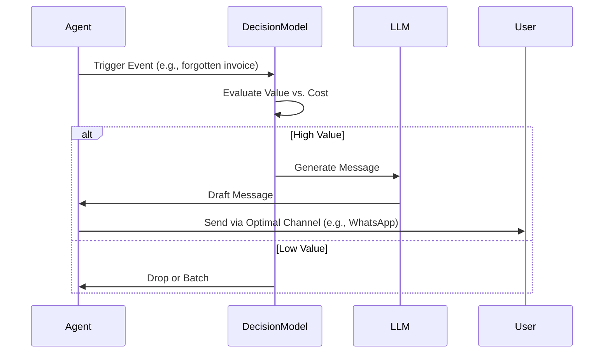
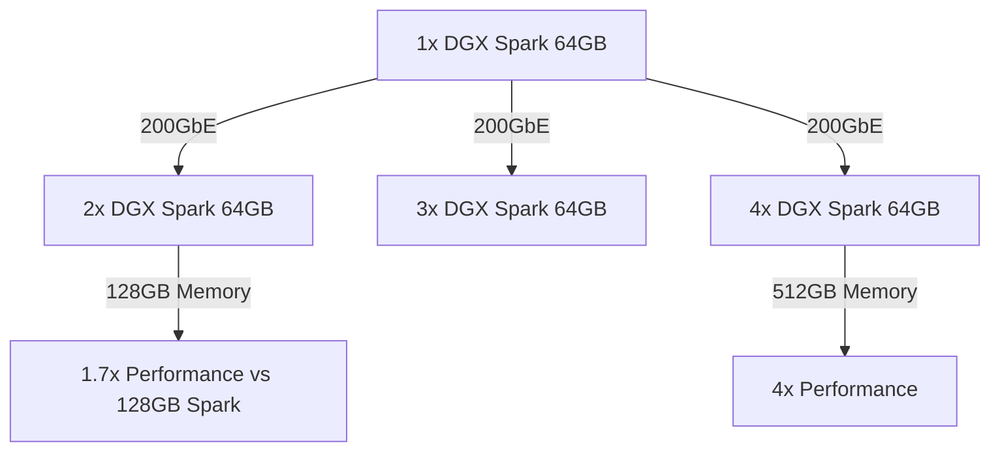

> 🎙️ **Listen to the podcast version of this article:**
> <audio controls src="index.mp3"></audio>

---

> 💡 **TL;DR:** October 2026 marks a pivotal month for AI innovation. OpenAI’s GPT-6 family introduces specialized models for reasoning, coding, and scalability, while Meta, OpenAI, and Uber redefine user interaction with proactive AI agents. Microsoft’s MAI-Transcribe-2-Streaming achieves #1 real-time transcription accuracy, and NVIDIA’s DGX Spark 64GB brings petaFLOP-level AI compute to the desktop, enabling local, cost-effective agent development and fine-tuning.

| Metric / Innovation Area | Insight / Takeaway |
|--------------------------|--------------------|
| **GPT-6 Model Family** | Specialized models (Astra, Sol, Luna) for reasoning, coding, and scalability, with dynamic reasoning levels and cost-efficient caching (up to 95% savings). |
| **Proactive AI Agents** | Meta’s Muse, OpenAI’s Dots, and Uber’s driver assistant shift from pull-based to push-based interactions, prioritizing user value over interruption costs. |
| **MAI-Transcribe-2-Streaming** | #1 real-time STT model with 2.5% WER at 0.13s latency, supporting 60 languages and continuous auto-detection. |
| **DGX Spark 64GB** | 1 petaFLOP desktop AI system for local agents, fine-tuning, and inference, clustering up to 4 units for 512GB memory and 4 petaFLOPS. |
| **Token Consumption Growth** | 14x increase in token usage since early 2026, driving demand for local, cost-effective AI hardware. |

---
### Introduction: Overview of Trending AI Topics for the Month

October 2026 has been a watershed moment for artificial intelligence, with innovations spanning model architectures, agentic systems, real-time processing, and hardware acceleration. The month’s highlights reflect a maturing AI ecosystem where **specialization**, **proactivity**, and **local compute** are becoming the norm. From OpenAI’s GPT-6 family to NVIDIA’s desktop AI powerhouses, the industry is pushing boundaries in usability, efficiency, and accessibility.

This article dives into four transformative developments:
1. **OpenAI’s GPT-6 Family**: A suite of models tailored for reasoning, coding, and scalability, with advanced features like dynamic reasoning levels and prompt caching.
2. **Proactive AI Agents**: Meta, OpenAI, and Uber’s shift toward agents that initiate interactions, balancing user value with interruption costs.
3. **Microsoft’s MAI-Transcribe-2-Streaming**: A real-time speech-to-text model that tops global benchmarks for accuracy and latency.
4. **NVIDIA’s DGX Spark 64GB**: A desktop AI system delivering petaFLOP-level performance, enabling local development of always-on agents and fine-tuning without cloud costs.

---
---

### 1. OpenAI’s GPT-6 Family: A New Era of Model Specialization and Workflow Optimization

#### **Context: The Need for Tailored Intelligence**
The AI landscape has evolved from one-size-fits-all models to specialized systems optimized for distinct workloads. OpenAI’s GPT-6 family embodies this shift, offering three models—**Astra**, **Sol**, and **Luna**—each designed for specific use cases. Astra targets the most complex reasoning tasks, Sol excels in coding and research, and Luna is built for scalable, repetitive tasks like data extraction or summarization. This specialization allows organizations to balance **capability**, **cost**, and **latency** based on their needs.

#### **Tech Deep Dive: Dynamic Reasoning and Cost Efficiency**
The GPT-6 family introduces **dynamic reasoning levels** (Low, Medium, High, Extra High/Max) and **speed modes** (Standard, Fast, Ultrafast) to optimize performance. For example:
- **Reasoning Levels**: Adjust the model’s effort based on task complexity. A simple fact extraction might use *Low*, while debugging complex code could leverage *Extra High*.
- **Speed Modes**: *Ultrafast* (exclusive to Astra) prioritizes response time for iterative tasks like coding, while *Standard* balances cost and performance.

**Cost efficiency** is a standout feature. OpenAI’s **prompt caching** reduces input token costs by up to 95% for recurring tasks by reusing shared context. For instance, stable instructions or reference material can be cached, while task-specific details remain dynamic. The **compaction** feature further reduces context size for long conversations without losing critical state.

**Mathematical Insight**: The cost savings from caching can be modeled as:
$$
	ext{Effective Cost} = C_{	ext{uncached}} 	imes (1 - alpha 	imes 	ext{Cache Hit Rate})
$$
where $alpha$ is the caching discount (up to 0.95), and $C_{	ext{uncached}}$ is the base cost.

#### **Why It Matters: Production-Ready AI Workflows**
The GPT-6 family is designed for **production-grade deployments**. Key features include:
- **Asynchronous Tools**: Models can continue independent work (e.g., running tests) while waiting for slower tasks to complete.
- **Multi-Agent Workflows**: GPT-6.1 Sol supports delegating subtasks to specialized agents (e.g., investigating different parts of a codebase) and aggregating results.
- **Computer Use**: Models can interact directly with websites and desktop apps (e.g., debugging code and verifying fixes in a browser).

**Future Outlook**: As AI workflows grow in complexity, the ability to dynamically adjust reasoning, cache context, and delegate tasks will become critical. OpenAI’s approach sets a benchmark for **cost-effective, scalable AI** in enterprise and startup environments alike.

---
---

### 2. Proactive AI Agents: Meta, OpenAI, and Uber Redefine User Interaction

#### **Context: From Pull to Push**
Traditional chatbots operate on a **pull-based** model: users initiate interactions when they need assistance. However, the next frontier of AI is **proactive agents** that anticipate needs and initiate actions. Meta’s **Muse**, OpenAI’s **Dots**, and Uber’s **driver assistant** exemplify this shift, moving the challenge from *what to answer* to *when to interrupt*, *on which channel*, and *with what offer*.

#### **Tech Deep Dive: The Decision Problem**
Proactive agents must solve a **value vs. interruption cost** equation. Every message sent is a bet: its expected value to the user must exceed the cost of interruption. The value is determined by:
1. **Stakes**: How critical is the information?
2. **User Action Likelihood**: Will the user act on the message?
3. **Urgency**: How quickly does the opportunity expire?
4. **Beneficiary**: Does it serve the user or the platform?

**Decision Models**: Classic machine learning tools like **uplift models** (predicting if a nudge causes action) and **contextual bandits** (optimizing timing and channel) are being augmented by **decision-specific models** like:
- **TypeSafe’s Jev**: A typed judgment model that outputs structured decisions (e.g., yes/no, scores) without generating text.
- **Supersonic Labs’ Julia 1**: A lightweight, CPU-based model for rapid decision-making (33ms per decision).

These models evaluate triggers cheaply before invoking LLMs, ensuring only high-value messages are sent.

#### **Why It Matters: The Attention Economy**
The success of proactive agents hinges on **judgment**. Over-interrupting leads to user fatigue (and muting), while under-interrupting misses opportunities. Uber’s driver assistant, for example, proactively suggests better zones based on real-time marketplace data, but only when the expected value (e.g., higher earnings) outweighs the interruption cost.

**Cross-Sell Caution**: Proactive agents are powerful distribution channels, but users must perceive messages as **serving their interests**, not the platform’s. Meta and OpenAI are exploring commerce integrations (e.g., Muse for Small Business, Dots’ $500/month tier), but credibility is fragile—once users suspect self-serving motives, trust erodes.

**Future Outlook**: Companies with rich notification data (e.g., Uber’s driver behavior logs) have a head start in training decision models. The race will be won by those who master **attention allocation**: speaking rarely, at the right moment, in the right place, and always on the user’s side.

---
---

### 3. Microsoft’s MAI-Transcribe-2-Streaming: The Gold Standard for Real-Time Speech-to-Text

#### **Context: The Latency-Accuracy Tradeoff**
Real-time speech-to-text (STT) is the backbone of voice agents, live captions, and dictation systems. The challenge lies in balancing **accuracy** and **latency**—users expect both instant responses and flawless transcripts. Microsoft’s **MAI-Transcribe-2-Streaming** shatters this tradeoff, ranking #1 on the **Artificial Analysis AA-WER Streaming** benchmark with a **2.5% Word Error Rate (WER)** at just **0.13 seconds** latency for final transcripts.

#### **Tech Deep Dive: How It Works**
- **Streaming Architecture**: Audio is processed in real-time, with partial transcripts emitted **100ms after audio input**. The model revises these partials as more context arrives, culminating in a stable final transcript.
- **Multi-Language Support**: Covers **60 languages** with **continuous automatic language detection**, making it ideal for global applications.
- **Pareto Frontier**: MAI-Transcribe-2-Streaming dominates the accuracy-latency tradeoff curve, outperforming competitors like Grok Voice Transcribe 2.0 (2.7% WER at 0.49s) and Muse Voice Transcribe (3.1% WER at 0.16s).

| Feature | MAI-Transcribe-2-Streaming | Grok Voice Transcribe 2.0 | Muse Voice Transcribe |
|---------|-----------------------------|----------------------------|------------------------|
| **Final WER** | 2.5% | 2.7% | 3.1% |
| **Time to Final** | 0.13s | 0.49s | 0.16s |
| **First Partial WER** | 2.5% | N/A | N/A |
| **Languages** | 60 | Dozens | 70+ |
| **Price/Hour** | $0.54 (intro) | $0.20 | $0.18 |

**Integration Paths**:
- **Realtime API**: For apps using OpenAI Realtime-compatible WebSockets.
- **Azure Speech SDK**: Handles connection management, retries, and audio streaming.
- **MAI Playground**: For testing and prototyping.

**Mathematical Insight**: The **WER** is calculated as:
$$
	ext{WER} = frac{S + D + I}{N}
$$
where $S$ = substitutions, $D$ = deletions, $I$ = insertions, and $N$ = total words in the reference transcript.

#### **Why It Matters: Enabling Real-Time AI Agents**
Low-latency, high-accuracy STT is critical for:
- **Voice Agents**: Enabling natural, interruptible conversations.
- **Live Captions**: Real-time accessibility for meetings and broadcasts.
- **Dictation**: Seamless transcription for note-taking and documentation.

**Future Outlook**: As voice becomes the primary interface for AI agents, models like MAI-Transcribe-2-Streaming will be the **unsung heroes** enabling fluid, human-like interactions. Microsoft’s dominance in this space positions it as a leader in **real-time AI**.

---
---

### 4. NVIDIA’s DGX Spark 64GB: Democratizing Local AI Development

#### **Context: The Rise of Local AI**
Cloud-based AI has dominated due to its scalability, but **token costs** and **latency** are becoming prohibitive. With token consumption growing **14x since early 2026**, organizations are seeking **local alternatives**. NVIDIA’s **DGX Spark 64GB** answers this call, delivering **1 petaFLOP of FP4 AI compute** in a desktop form factor, enabling developers to run **always-on agents**, fine-tune models, and evaluate new releases **without per-token fees**.

#### **Tech Deep Dive: The GB10 Grace Blackwell Superchip**
The DGX Spark 64GB is powered by NVIDIA’s **GB10 Grace Blackwell superchip**, which pairs:
- A **Blackwell GPU** with 5th-gen Tensor Cores (up to 1 petaFLOP FP4 with sparsity).
- A **20-core Arm CPU** (10x Cortex-X925 + 10x Cortex-A725).
- **64GB LPDDR5x unified memory** (coherent CPU-GPU access via NVLink-C2C, 5x faster than PCIe Gen 5).

**Key Specifications**:
| Spec | DGX Spark 64GB |
|------|----------------|
| **AI Compute** | 1 petaFLOP FP4 (with sparsity) |
| **Memory Bandwidth** | 273 GB/s |
| **Storage** | 1-4TB NVMe M.2 (self-encrypting) |
| **Networking** | ConnectX-7 NIC (200GbE), Wi-Fi 7, Bluetooth 5.3 |
| **Max Local Model Size** | ~100B parameters |
| **Power** | Standard wall outlet (no server room needed) |

**Supported Models**:
| Model | Developer | Footprint | Role |
|-------|-----------|-----------|------|
| Muse Glimmer | Meta | ~17GB (quantized) | Main agent model |
| Nemotron 3.5 Lightning | NVIDIA | NVFP4 checkpoint | Fast executor for long-running agents |
| Qwen3.8-27B | Alibaba Qwen | ~13.5GB (4-bit) | General agent and coding |

#### **Clustering for Scalability**
The DGX Spark 64GB supports **clustering** via **ConnectX-7 networking**, enabling:
- **2 Units**: 128GB memory, 2 petaFLOPS, **1.7x performance of a single 128GB Spark** (due to doubled bandwidth).
- **4 Units**: 512GB memory, 4 petaFLOPS (requires a 200GbE switch).

**Use Cases**:
1. **Always-On Personal Agents**: Run models like Muse Glimmer or Nemotron 3.5 Lightning 24/7 for tasks like code triage, test reproduction, and PR drafting.
2. **Fine-Tuning**: QLoRA on a 70B model fits in 64GB. Train on proprietary data for domain-specific assistants.
3. **Model Evaluation**: Benchmark new open-weight models locally without API costs.
4. **Multi-Model Agents**: Run multiple models (e.g., Bonsai 2 as a router, Glimmer as the reasoner) in unified memory.
5. **Edge Prototyping**: Fine-tune vision transformers for tasks like anomaly detection, then deploy to NVIDIA Jetson devices.

#### **Why It Matters: The End of Per-Token Billing?**
The DGX Spark 64GB addresses two major pain points:
1. **Cost**: No per-token fees for local inference or fine-tuning.
2. **Latency**: Unified memory and high bandwidth enable **fast context processing** for long-input tasks.

**Limitations**:
- Not designed for **high-concurrency** workloads (e.g., 100-user chat servers).
- Best suited for **long-input, short-output** tasks (e.g., analyzing repos, logs, or papers).

**Future Outlook**: As open models continue to improve, local AI development will become the **default** for many organizations. NVIDIA’s DGX Spark 64GB is a **game-changer** for startups and enterprises alike, offering a path to **scalable, cost-effective AI** without cloud dependency.

---
---
### Conclusion: The AI Landscape in October 2026

October 2026 has been a month of **specialization**, **proactivity**, and **local empowerment** in AI. OpenAI’s GPT-6 family demonstrates how **tailored models** and **dynamic reasoning** can optimize workflows, while Meta, OpenAI, and Uber are redefining user interactions with **proactive agents** that respect attention as a scarce resource. Microsoft’s MAI-Transcribe-2-Streaming sets a new standard for **real-time speech-to-text**, and NVIDIA’s DGX Spark 64GB brings **petaFLOP-level compute** to the desktop, enabling local AI development at scale.

The common thread? **Efficiency**. Whether it’s reducing token costs, minimizing interruptions, or eliminating cloud fees, the AI industry is converging on solutions that deliver **more value with fewer resources**. As we look ahead, the winners will be those who can **balance intelligence with judgment**, **speed with accuracy**, and **scalability with affordability**.

The future of AI is not just smarter—it’s **smarter about how it uses its smarts**.

Written with [Argos](https://github.com/Neilstid/argos)
