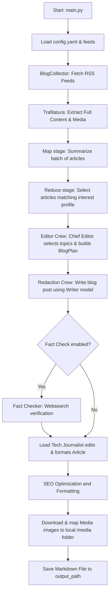

# Overview

**Argos** is an AI-powered news blog generator and RSS feed discovery framework designed to automate the process of collecting, distilling, and redacting high-quality articles from various technical blogs and publications. 

By leveraging a combination of **CrewAI** for multi-agent workflows, **LiteLLM** for LLM orchestration, and modern data ingestion libraries like **Trafilatura** and **BeautifulSoup**, Argos takes configured RSS feeds and transforms raw HTML pages into a beautifully formatted Markdown article tailored for Hugo Blox (Academic theme).

Additionally, Argos is equipped with a **Model Context Protocol (MCP)** server, making its RSS parsing, search, and validation tools available to external LLM environments.

---

# System Architecture

The following diagram illustrates the flow of data through Argos, from feed collection to the final formatted markdown file:



---

# Technical Component Details

### 1. Ingestion Pipeline
At the beginning of a run, the system uses BlogCollector in rss_feed.py to process all configured sources.
* **RSS Parsing**: It parses XML/Atom feeds using `feedparser`.
* **Full-Text Scraping**: For each post, it fetches and parses the destination URL using `trafilatura` to extract the main body text without page clutter (navigation bars, ads, footer).
* **Media Tracking**: If image inclusion is enabled, it uses `BeautifulSoup` to scan the raw HTML, extract image source URLs and figure captions, assign temporary `media-uuid` identifiers, and keep a registry mapping these IDs back to their original URLs.

### 2. Map-Reduce Layer
Before passing raw data to the agent crews, the system uses a Map-Reduce layer implemented in map_reduce.py to manage context window limits and ensure high relevance:
* **Map Stage**: Raw text contents can be extremely large. The **Article Summarizer** agent digests the raw content of each article and produces a concise 4-5 sentence abstract, returning them as structured  data.
* **Reduce Stage**: The **Article Selector** agent evaluates these abstracts against the user's specific interest profile and filters out low-relevance content.

### 3. Agent Coordination (CrewAI Workflow)
The final stage of redaction uses a multi-agent orchestration managed inside:
* **The Editor Crew**: The Chief Editor analyzes the abstracts of the reduced articles and generates a structured BlogPlan containing the `selected_paper_ids` (typically 2-3 topics) and a `table_of_contents`.
* **The Redaction Crew**: 
  * The Lead Tech Journalist drafts the blog post content using the plan and selected full articles. The draft is constructed using a premium hybrid layout (TL;DR blockquote, key highlights table, Mermaid flowcharts for process visualization, LaTeX equations for mathematical expressions, and structured code blocks).
  * The Fact Checker (optional): Activated with `--fact-check`. Uses a DuckDuckGo Search API tool (websearch) to check claims, add accurate contexts, and clear explanations.

### 4. Output Formatting & Post-Processing
After the redaction crew outputs the structured Article pydantic object, NewsBlogWorkflow.format processes it:
* **Image Downloading**: Any `media-uuid` referenced in the written content is downloaded locally, saved inside a `./media` subdirectory, and the UUID in the markdown is replaced with the local path.
* **Hugo Frontmatter**: Adds metadata fields (`title`, `summary`, `date`, `tags`, `math: true`, `authors: [admin]`) to output a ready-to-use markdown file.

---

# Model Context Protocol (MCP) Integration

Argos includes an MCP server implementation in mcp_server.py built using the `FastMCP` framework. It exposes the following tools:
* `read_feed`: Reads and extracts article information from a single RSS feed URL.
* `read_feeds_from_config`: Reads and extracts article details from all feeds defined in a YAML configuration file.
* `get_feed_from_url`: Discovers the RSS feed endpoint for a given website URL using rss_finder.
* `get_feeds_from_subject`: Performs a DuckDuckGo web search to find blog sites related to a subject, and attempts to find their RSS feeds automatically using search_blogs_ddg.

To access Argos via the public MCP hosting:
```
https://argos-rss.fastmcp.app/mcp
```

---

# Observability and Tracing

Argos integrates with MLflow to provide comprehensive logging and execution traces for the underlying CrewAI agents. 
When main.py runs:
1. Traces and agent reasoning loops are logged automatically to a local MLflow experiment named `argos-news-blog`.
2. Traces can be viewed by running `uv run mlflow ui` and navigating to `http://localhost:5000`.

---

# Changelog

**12/08/2026**: Adding AI generated banner for blog articles using open-routers models.