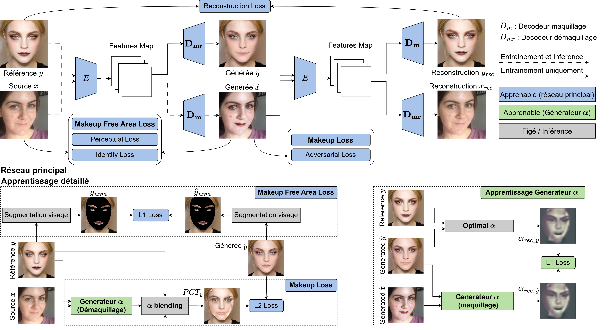

### Méthode

L'architecture du modèle consiste en deux étapes d'apprentissage distinctes : l'apprentissage de l'encodeur/décodeur et l'apprentissage auto-supervisé du générateur \(\alpha\). 
L'apprentissage de l'encodeur/décodeur consiste à :

- Extraire les caractéristiques avec un encodeur \(E\), prenant en entrée une source $x$ et une référence \(y\).
- Générer des images avec un décodeur pour le maquillage et le démaquillage (notés respectivement \(D_m\) et \(D_{mr}\)).

En plus des fonctions de perte utilisées par EleGANt, nous avons ajouté la fonction de perte Makeup Free Area Loss, qui assure la cohérence des zones sans maquillage (comme l'arrière-plan). 

