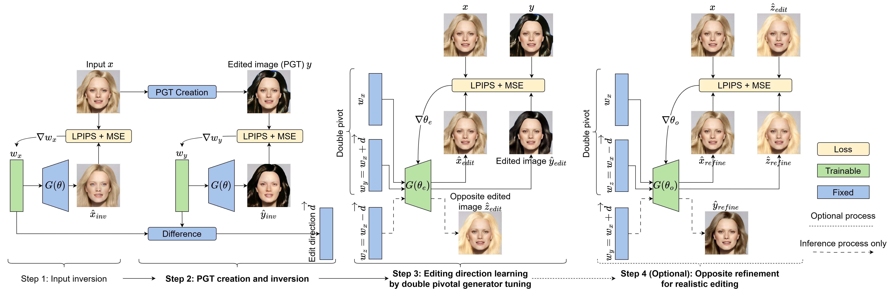

### Méthode

Pour guider le réseau dans le processus d'apprentissage de l'édition, des fausses cibles sont créées : les pseudo-vérités terrain (PGT). Ces PGT sont créés via des techniques de traitement d'image traditionnelles à partir de l'image d'entrée \(x\). Pour $k$ directions d'édition, les PGT sont désignées par \(y_1\), ..., \(y_k\) (étape 2.a). Le nombre de directions \(k\) est compris entre 1 et la dimensionnalité de l'espace latent, soit 512 pour StyleGAN.

#### Création  des directions d'édition

Pour réaliser l'édition, une  direction d'édition est associée à chacune des \(k\) pseudo-vérités terrain (PGT). Ces directions sont notées \(\overrightarrow{d_1}\), ..., \(\overrightarrow{d_k}\), respectivement pour les PGT \(y_1\), ..., \(y_k\). Ces directions sont obtenues via l'utilisation des dimensions de l'espace latent peu utilisées pour la génération des images (étape 2.b).

#### Apprentissage  des directions d'édition

L'image inversée \(\hat{x}_{inv}\) est souvent floue par rapport à l'image originale et l'identité est perdue. Pour résoudre ce problème, le PTI finetune le générateur \(G\) de sorte que l'image générée \(\hat{x}_{inv}\) soit similaire à l'image réelle \(x\). Cette opération de finetuning crée une copie de l'image d'entrée dans l'espace latent du générateur avec les poids \(\theta_{pt}\). Nous avons poussé plus loin cette idée de finetuning du générateur pour éditer les attributs d'une image réelle \(x\). Une fois que le générateur \(G\) est finetuné, il peut éditer les caractéristiques souhaitées sur l'image \(x\) en suivant les directions d'éditions \(\overrightarrow{d_1}\), ..., \(\overrightarrow{d_k}\).

### Resultat

#### Resultat Quantitatif

| Metrics                                     |    IC    |  LD_o  |   MSE_o  |     SSIM    |  FID |   KID  |
|---------------------------------------------|:------------------:|:----------------:|:------------------:|:-------------------:|:----------------:|:------------------:|
| Resefa [^2]    |        0.32        |       $154$      |       $0.89$       |       $0.859$       |       $89$       |       $1.70$       |
| StyleMapGAN [^3] |       0.27       |   **29**  |        1.43        |        0.963        |        119       |       $2.37$       |
| SOAT [^4]          |   **0.08**  | *51* |   **0.09**  |   **0.995**  | *76* | *0.87* |
| EMP                                         | *0.11* |       67     | *0.21* | *0.969* |   **31**  |   **0.31**  |

#### Resultat Qualitatif

	

	

	
	<input type="range" class="slider" min="1" max="100" value="50" />
	

### Reference

[^1]: D. Roich, R. Mokady, A. H. Bermano, and D. CohenOr, “Pivotal tuning for latent-based editing of real images,” ACM Transactions on Graphics (TOG), vol. 42, p. 1–13, Feb 2023.

[^2]: J. Zhu, Y. Shen, Y. Xu, D. Zhao, and Q. Chen, “Region-based semantic factorization in GANs,” in International Conference on Machine Learning (ICML), 2022.

[^3]: H. Kim, Y. Choi, J. Kim, S. Yoo, and Y. Uh, Exploiting Spatial Dimensions of Latent in GAN for Realtime Image Editing, p. 852–861. IEEE, Jun 2021.

[^4]: M. J. Chong, H.-Y. Lee, and D. Forsyth, “Stylegan of all trades : Image manipulation with only pretrained stylegan,” arXiv, 2021.